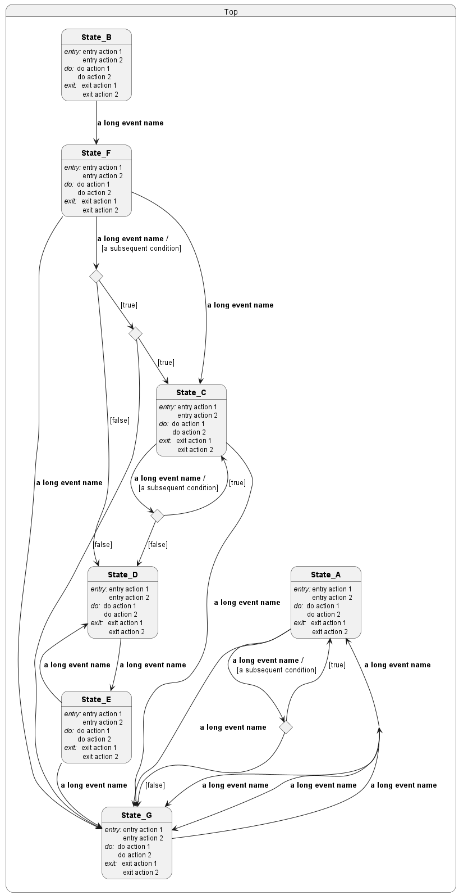
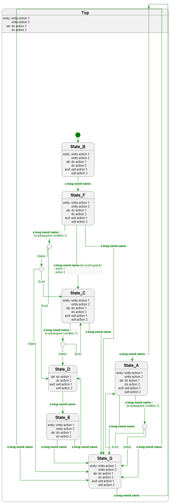
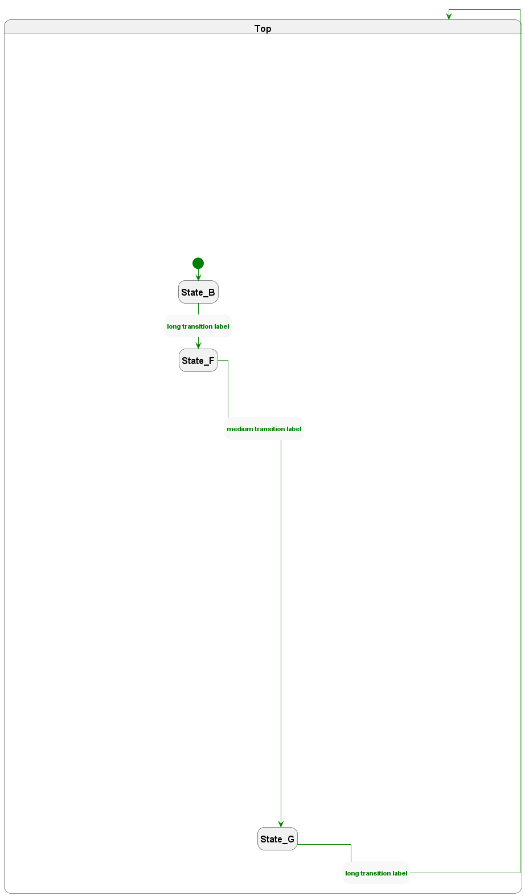
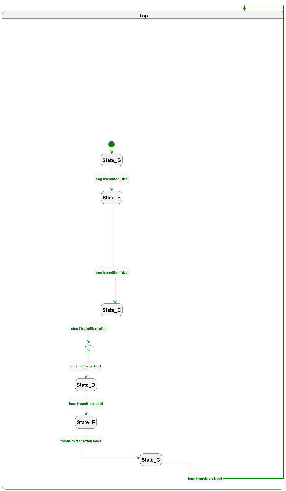
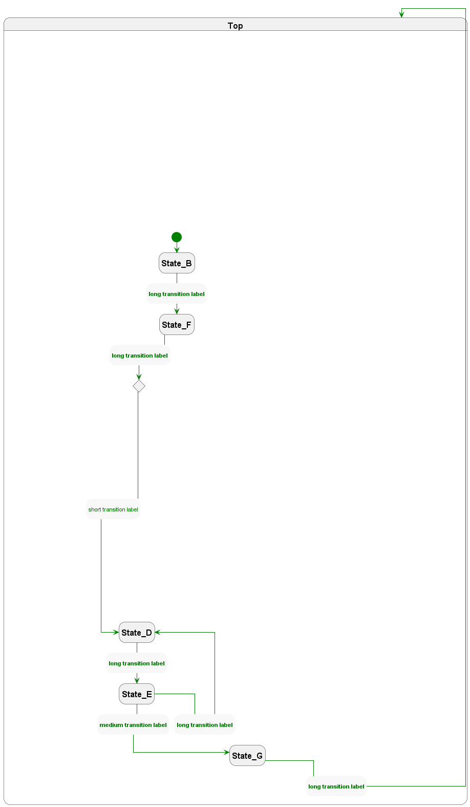

# PlantUML Utilities

*Note* - This depends on use of a custom `plantuml.jar` file which I have been
developing in a fork of the plantuml repo: https://github.com/davmf/plantuml/tree/develop

My goals with this work are as follows:

 - to improve the appearance of plantuml state diagrams, especially complex ones
 - (in conjunction with some preprocessing in another repo) to allow for hiding
   of selected diagrm elements and links while retaining the overall layout

## Original state diagram

The state diagram below is compiled using a recent build of standard plantuml.

## Refined state diagram

The state diagram below is compiled using my customised build in conjunction with a set of functions and procedures, in this repo, that I have developed.

Improvements are as follows:

  - I have replaced labels on links with states that are formatted to attempt to appear like link labels.
  - This makes the use of orthogonal links much more useable.
  - I have had to perform a minor hack of the plantuml.jar file to allow ready removal of the arrowheads pointing to each transition label.
    - I would like to improve these labels further by reducing their height somehow and removing the rounded corners on the background.  Also, it would be good to align the two points where the arrow connects with the label.

## Output filtering to highlight various transition sequences

I made further tweaks to the plantuml.jar file to enhance the ability to make elements transparent.  This along with some preprocessor work allows selected transition sequences to be displayed while retaining the overall layout.

